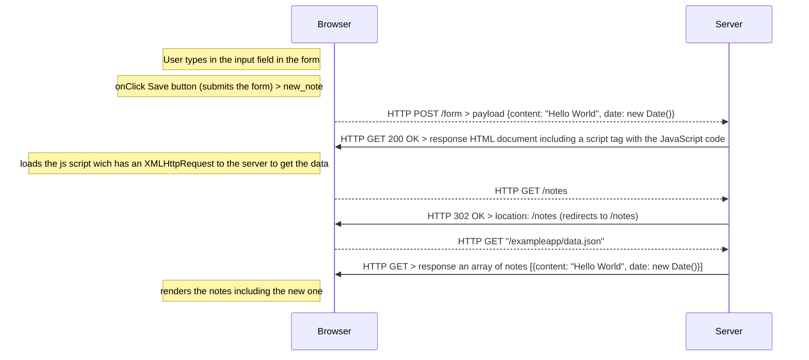

```mermaid
sequenceDiagram
    Note left of Browser: User types in the input field in the form
    Note left of Browser: onClick Save button (submits the form) > new_note
    Browser -->>Server: HTTP POST /form > payload {content: "Hello World", date: new Date()}
    Server->>Browser: HTTP GET 200 OK > response HTML document including a script tag with the JavaScript code
    Note left of Browser: loads the js script wich has an XMLHttpRequest to the server to get the data
    Browser -->>Server: HTTP GET /notes
    Server->>Browser: HTTP 302 OK > location: /notes (redirects to /notes)
    Browser -->>Server: HTTP GET "/exampleapp/data.json"
    Server->>Browser: HTTP GET > response an array of notes [{content: "Hello World", date: new Date()}]
    Note left of Browser: renders the notes including the new one
```
